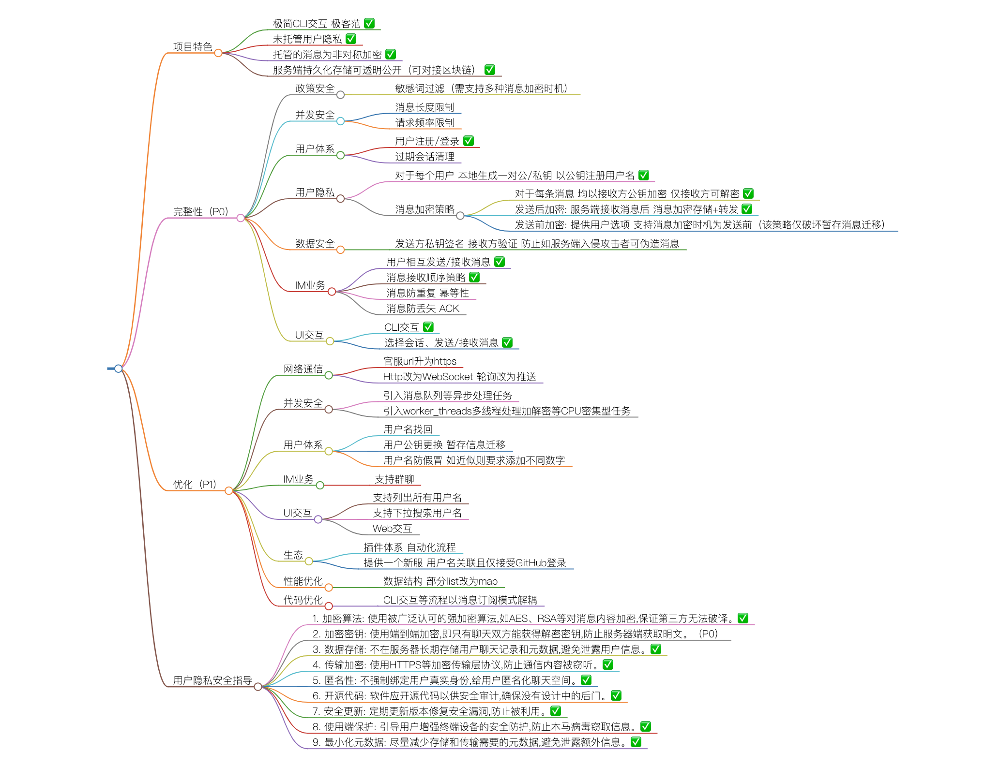

# Simple RSA-HTTP Chat

## [Roadmap](Roadmap.md)




## How to play?

```sh
# Option #1: Install from npm
npm i -g rsa-im

# Option #2: Install from source
git clone git@github.com:fritx/rsa-im.git
cd rsa-im
npm install
npm link

# Play with offical host
rsa-im
>> Signing up... username:
```

## Host your own server?

```sh
npm install

# server
PORT=3008 node server
>> Listening at http://localhost:3008/

# client
SERVER_URL=http://localhost:3008 node client
>> Signing up... username:
```

## Available Hosts

|URL |Description  |
|:---|:---|
|https://fritx.me/im/ |Official (Default) |
|https://... |...  |
|https://...  |... |
|https://...  |... |
